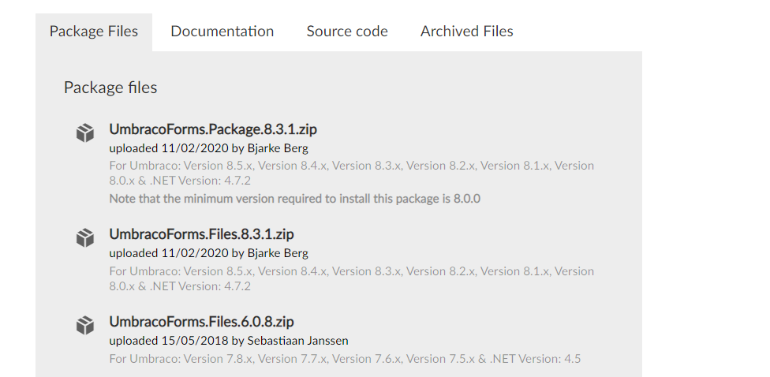
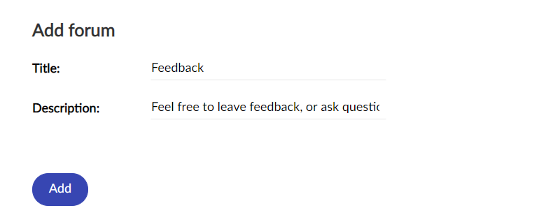

# Maintaining packages

Once you've created and published your package, what's involved in its ongoing maintenance?

## Keep it up-to-date

When a new version of Umbraco is released you should test your package on this latest version to confirm it still works. 

### If the package still works

The current package repository on [Our](https://our.umbraco.com/packages/) does not allow you to edit your list of supported versions. The only way to do this, at present, is to upload the package file again and set the full range of supported versions at the same time. You can edit your packages, including uploading new files, from [your packages profile page](https://our.umbraco.com/member/profile/packages/). As this is a replacement file you should archive the previous one and then mark the new one as 'current'.

It would also be helpful to ensure that the 'Package Compatibility' details are correct on the package's public page on [Our](https://our.umbraco.com/packages/).

### If the package needs updating

Make the changes required so that your code works on the latest version of Umbraco. Next you need to create a new version of your package. Read the [Creating a Package](./creating-a-package.md) article for guidelines on creating the package zip file using the backoffice.  

To publish your new version on Our, visit [your packages profile page](https://our.umbraco.com/member/profile/packages/) and select the package that you are updating. 

- On the 'Package Details' section of the form update the 'Current Version'. You should also add some details about which versions of your package are for which version of Umbraco in the 'Package Description'. For example:

- On the 'Package Files' section of the form you can upload a new file and then make it the 'current' one. You don't have to archive the previous version as you are allowed multiple active ones that will all appear in the Package Files list, for example:

You can only have one 'current' file - this is the version that will be downloaded from the main button on the package's public page:

If your package is available on Nuget then you should also release this new version to Nuget. This will be a similar process to the one described in [Creating a Nuget Package](./creating-a-nuget-package.md).

## Manage feature requests and issues

If you want to encourage feedback, feature requests, and issue reports then you should add a forum to your package. You can manage your forums from [your packages profile page](https://our.umbraco.com/member/profile/packages/):

To add a new forum you will need to specify a name and a description, such as:

Any forum you create will appear under the Package Files list on the package's public page:

## Find collaborators

If you are a sole maintainer of a package then it's a good idea to find someone to help you. If you have accepted pull requests from people then why not ask them if they would like to collaborate.

If someone requests a feature that you think is a good fit but you don't have the time, then ask that person if they would like to work with you to get it added.

If you'd like to find a collaborator you are welcome to raise a 'Request for Collaborators' via the [Umbraco Package Team tracker](https://github.com/umbraco/Umbraco.Packages).

### Add collaborators on Our

You can assign other Our members to the 'team' for your package. Team members will see the package in their list to maintain, and will be able to edit its details.  You can manage your team of collaborators from [your packages profile page](https://our.umbraco.com/member/profile/packages/):

## Package no longer required?

If your package should no longer be used (perhaps it is now too old, or it has been superseded by another one that you recommend instead), then you should update your package accordingly via [your packages profile page](https://our.umbraco.com/member/profile/packages/):

At the bottom of the 'Package Details' form, tick to say 'Retired' and specify the reason for the retirement

Moving 'Next' will save your changes, and the retired status and reason will be displayed prominently on the package's public page:

